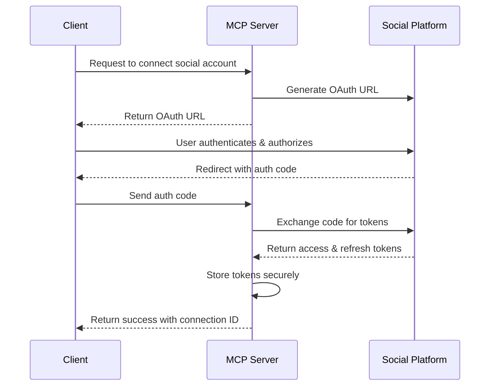

# Google Ads Integration MCP Server (Hackathon Edition)

A Google Cloud-native MCP server designed for the Google Ads Hackathon, providing seamless integration between Google Ads and various social media platforms. Built with scalability and rapid development in mind, this server leverages Google Cloud's serverless offerings for cost-effective and scalable deployment.

## Table of Contents
- [Architecture Overview](#architecture-overview)
- [System Design](#system-design)
- [Core Components](#core-components)
- [API Endpoints](#api-endpoints)
- [Authentication Flow](#authentication-flow)
- [Data Flow](#data-flow)
- [Security Considerations](#security-considerations)
- [Deployment](#deployment)
- [Scaling](#scaling)
- [Monitoring & Logging](#monitoring--logging)
- [Future Enhancements](#future-enhancements)

## Architecture Overview (Google Cloud Hackathon)

```
┌───────────────────────────────────────────────────────────────────────────────────────────────┐
│                              Client Applications                                              │
│  ┌─────────────┐  ┌─────────────┐  ┌─────────────┐  ┌──────────────────────────────────┐  │
│  │ Web Clients │  │ Mobile Apps │  │  B2B APIs   │  │       Admin Dashboard           │  │
│  └─────────────┘  └─────────────┘  └─────────────┘  └──────────────────────────────────┘  │
└───────────────────────────────┬───────────────────────────────────────────────────────────────┘
                                │
                                ▼
┌───────────────────────────────────────────────────────────────────────────────────────────────┐
│                                 API Gateway Layer                                             │
│  ┌───────────────────────────────────────────────────────────────────────────────────────┐  │
│  │  Kong/APISIX/Envoy                                                                  │  │
│  │  • Request Routing & Load Balancing                                                   │  │
│  │  • Authentication & Authorization (OAuth2, JWT)                                      │  │
│  │  • Rate Limiting & Throttling                                                        │  │
│  │  • Request/Response Transformation                                                   │  │
│  └───────────────────────────────────────────────────────────────────────────────────────┘  │
└───────────────────────────────────────────────┬───────────────────────────────────────────────┘
                                                │
┌───────────────────────────────────────────────▼───────────────────────────────────────────────┐
│                                  Service Mesh (Istio/Linkerd)                                 │
│  ┌───────────────────────────────────────────────────────────────────────────────────────┐  │
│  │  • Service Discovery & Load Balancing                                              │  │
│  │  • mTLS Encryption                                                                 │  │
│  │  • Circuit Breaking & Retries                                                      │  │
│  │  • Distributed Tracing                                                             │  │
│  └───────────────────────────────────────────────────────────────────────────────────────┘  │
└───────────────────────────────────────────────┬───────────────────────────────────────────────┘
                                                │
┌───────────────────────────────────────────────────────────────────────────────────────────────┐
│                          Core Services (Google Cloud Run)                                      │
│  ┌─────────────────────┐  ┌─────────────────────┐  ┌──────────────────────────────────┐  │
│  │  API Services       │  │  Business Logic     │  │  Google Ads Integration          │  │
│  │  • Cloud Functions  │  │  • Cloud Run        │  │  • Google Ads API Client         │  │
│  │  • REST/GraphQL     │  │  • Workflow Engine  │  │  • Conversion Tracking          │  │
│  └─────────┬───────────┘  └──────────┬──────────┘  └──────────────────┬───────────────┘  │
│            │                           │                              │                   │
│  ┌─────────▼───────────┐  ┌──────────▼──────────┐  ┌───────────────────▼──────────────┐  │
│  │  Data Services      │  │  Event Processing   │  │  External Services             │  │
│  │  • Firestore        │  │  • Pub/Sub          │  │  • Social Media APIs           │  │
│  │  • BigQuery         │  │  • Eventarc         │  │  • Webhook Handlers            │  │
│  │  • Memorystore      │  │  • Workflows        │  │  • OAuth 2.0 Flows             │  │
│  └─────────────────────┘  └─────────────────────┘  └──────────────────────────────────┘  │
└───────────────────────────────────────────────────────────────────────────────────────────────┘
                                                │
┌───────────────────────────────────────────────▼───────────────────────────────────────────────┐
│                                 Google Cloud Operations                                       │
│  ┌─────────────────────┐  ┌─────────────────────┐  ┌──────────────────────────────────┐  │
│  │  Monitoring         │  │  Logging            │  │  Error Reporting                 │  │
│  │  • Cloud Monitoring │  │  • Cloud Logging    │  │  • Error Reporting              │  │
│  │  • Custom Metrics   │  │  • Log-based Metrics│  │  • Debugger                     │  │
│  └─────────────────────┘  └─────────────────────┘  └──────────────────────────────────┘  │
└───────────────────────────────────────────────────────────────────────────────────────────────┘
```
```

## System Design (Google Cloud Hackathon)

### 1. Core Principles
- **Serverless-First**: Maximize use of Google's serverless offerings for scalability and cost-efficiency
- **Event-Driven**: Leverage Pub/Sub for asynchronous processing
- **Cost-Effective**: Optimized for Google Cloud's free tier and hackathon credits
- **Rapid Development**: Focus on Google Ads integration and core features
- **Minimal Ops**: Use managed services to reduce operational overhead

### 2. Google Cloud Stack

#### Core Technologies
- **Languages**: 
  - Python 3.11 (primary)
  - Node.js (for Cloud Functions)
  - SQL (for BigQuery)
  
#### Backend Services
- **Compute**:
  - Cloud Run (containerized services)
  - Cloud Functions (serverless functions)
  - App Engine (if needed)
  
#### Data Layer
- **Databases**:
  - Firestore (NoSQL document database)
  - BigQuery (analytics and reporting)
  - Memorystore (Redis) for caching
  
#### Event Processing
- **Pub/Sub**: Asynchronous messaging
- **Eventarc**: Event-driven architecture
- **Workflows**: Orchestration of services

#### API Management
- **API Gateway**: Managed API Gateway
- **Cloud Endpoints**: For API management
- **Cloud Load Balancing**: Global load balancing

#### Security
- **Secret Manager**: For API keys and credentials
- **IAM**: Fine-grained access control
- **VPC Service Controls**: Data protection

#### CI/CD
- **Cloud Build**: For CI/CD pipelines
- **Artifact Registry**: Container and package storage
- **Cloud Deploy**: Managed deployment service

### 3. Google Ads Integration

#### Key Features
- **Campaign Management**: Create and manage ad campaigns
- **Audience Targeting**: Leverage Google's audience segments
- **Conversion Tracking**: Track cross-platform conversions
- **Automated Bidding**: Smart bidding strategies
- **Reporting**: Custom reports and dashboards

#### Integration Points
1. **Google Ads API**
   - Campaign management
   - Keyword planning
   - Performance metrics
   
2. **Google Analytics 4**
   - User journey tracking
   - Conversion events
   - Audience segmentation
   
3. **Google Tag Manager**
   - Event tracking
   - Custom tag implementation

### 4. Development Setup for Hackathon

#### Prerequisites
- Google Cloud Account (with $300 free credits)
- Google Ads API access
- Python 3.11+
- Google Cloud SDK
- Docker (for local development)

#### Local Development
```bash
# Clone the repository
git clone https://github.com/your-org/google-ads-mcp.git
cd google-ads-mcp

# Set up Python virtual environment
python -m venv venv
source venv/bin/activate  # On Windows: venv\Scripts\activate

# Install dependencies
pip install -r requirements.txt

# Set up environment variables
cp .env.example .env
# Edit .env with your Google Cloud and API credentials

# Run local development server
python main.py
```

#### Deployment Script
```bash
# Deploy to Google Cloud Run
gcloud run deploy google-ads-mcp \
  --source . \
  --platform managed \
  --region us-central1 \
  --allow-unauthenticated
```

### 5. Hackathon Focus Areas

#### Core Features (MVP)
1. Google Ads campaign creation wizard
2. Cross-platform performance dashboard
3. Automated budget optimization
4. Social media post scheduling
5. Basic reporting

#### Advanced Features (If Time Permits)
1. AI-powered ad copy generation
2. Predictive budget allocation
3. Competitor analysis
4. Multi-channel attribution modeling
5. Custom audience creation

### 6. Cost Optimization
- Use Cloud Run's scale-to-zero capability
- Leverage Firestore's free tier
- Implement caching with Memorystore
- Use Cloud Scheduler for batch processing
- Monitor costs with Cloud Billing reports

## Core Components

### 1. API Layer
- RESTful API endpoints
- WebSocket support for real-time updates
- Request validation and response formatting
- API versioning
- CORS and security headers

### 2. Authentication Service
- OAuth 2.0/OpenID Connect provider
- JWT token management
- Token refresh mechanism
- Social login integration

### 3. Adapter Layer
- Platform-specific implementations
- Request/response transformation
- Error handling and normalization
- Rate limit management per platform

### 4. Rate Limiting Service
- Per-user rate limiting
- Per-IP rate limiting
- Platform-specific rate limit tracking
- Circuit breaker pattern implementation

### 5. Task Queue
- Asynchronous task processing
- Scheduled jobs
- Retry mechanisms for failed tasks
- Priority queues

## API Endpoints

### Authentication
- `POST /auth/login` - User authentication
- `POST /auth/refresh` - Refresh access token
- `POST /auth/revoke` - Revoke token

### Social Media Integration
- `GET /api/v1/social/profiles` - List connected social profiles
- `POST /api/v1/social/connect/{platform}` - Connect social account
- `DELETE /api/v1/social/disconnect/{platform}` - Disconnect social account

### Content Management
- `POST /api/v1/content` - Create new post
- `GET /api/v1/content` - List posts
- `GET /api/v1/content/{id}` - Get post details
- `DELETE /api/v1/content/{id}` - Delete post

### Analytics
- `GET /api/v1/analytics/engagement` - Engagement metrics
- `GET /api/v1/analytics/reach` - Reach metrics
- `GET /api/v1/analytics/audience` - Audience demographics

## Authentication Flow



## Data Flow

1. **Request Reception**: API Gateway receives the request and routes it to the appropriate service
2. **Authentication**: Auth Service validates the JWT token
3. **Rate Limiting**: Request is checked against rate limits
4. **Processing**: Core logic processes the request
5. **Adapter Selection**: Appropriate social media adapter is selected
6. **API Call**: Request is made to the social media platform
7. **Response Handling**: Response is transformed to a standard format
8. **Caching**: Response is cached if applicable
9. **Logging**: Request/response is logged for analytics
10. **Response**: Formatted response is returned to the client

## Security Considerations

### Data Protection
- All sensitive data encrypted at rest
- TLS 1.3 for all communications
- Regular security audits
- Secrets management using HashiCorp Vault or AWS Secrets Manager

### Access Control
- Role-based access control (RBAC)
- Principle of least privilege
- IP whitelisting for admin endpoints
- Audit logging for all sensitive operations

## Deployment

### Prerequisites
- Docker 20.10+
- Docker Compose 2.0+
- Kubernetes cluster (for production)

### Local Development
```bash
# Clone the repository
git clone https://github.com/your-org/social-mcp-server.git
cd social-mcp-server

# Copy environment variables
cp .env.example .env

# Update environment variables in .env

# Start services
docker-compose up -d
```

### Production Deployment
1. Set up a Kubernetes cluster
2. Configure Helm charts
3. Set up monitoring and logging
4. Configure CI/CD pipeline
5. Deploy with ArgoCD or similar

## Scaling

### Horizontal Scaling
- Stateless services can be scaled horizontally
- Database read replicas for read-heavy workloads
- Sharding for very large datasets

### Caching Strategy
- Redis for session storage
- CDN for static assets
- Database query caching

## Monitoring & Logging

### Metrics Collection
- Prometheus for metrics collection
- Grafana for visualization
- Custom dashboards for business metrics

### Logging
- Structured JSON logging
- Centralized log aggregation with ELK
- Log rotation and retention policies

### Alerting
- AlertManager for alerting
- PagerDuty/Slack integration
- On-call rotation

## Future Enhancements

1. **Webhook Support**: Real-time event notifications
2. **More Platforms**: Additional social media integrations
3. **AI/ML**: Content recommendations and sentiment analysis
4. **Compliance**: GDPR, CCPA compliance tools
5. **White-labeling**: Custom branding for enterprise clients

## Contributing

1. Fork the repository
2. Create a feature branch
3. Commit your changes
4. Push to the branch
5. Create a pull request

## License

This project is licensed under the MIT License - see the [LICENSE](LICENSE) file for details.
